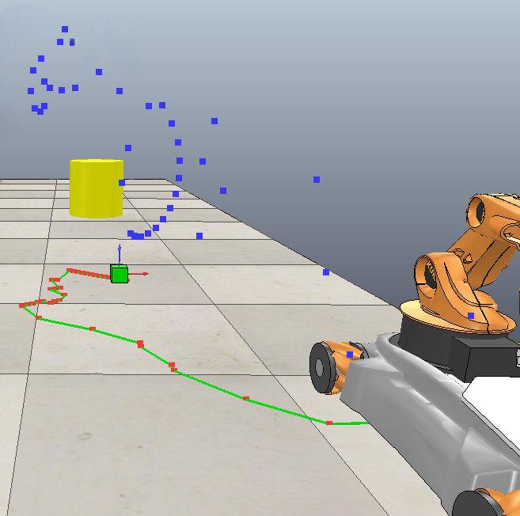

# Kuka youBot <EN>
Let's MoveIt Mobile Manipulator :)

This project is based on Kuka YouBot mobile Manipultor performing motion planning.

## Overview
1. This repository contains code to simulate a pick-and-place task using a Kuka youBot mobile manipulator (a mobile base with four mecanum wheels and a 5R robot arm) in CoppeliaSim. 
2. Static Obstacles with wall and primitive shapes
3. Feedback Controller
4. Motion planning 

## Package Description
This project is packaged into occupancy_grid, base_planner, manipulator_planner, controller, simulation_manager

## Setup
1. run this command to install zmq api in your venv- `pip install coppeliasim-zmqremoteapi-client`
2. run simulation_manager.py

## Results
1. A* path of base with Euclidean heuristic

